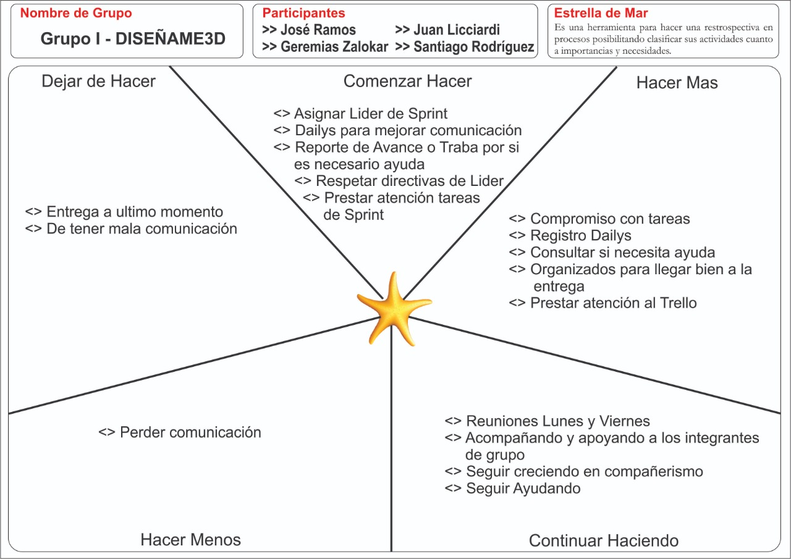

# **PRESENTACION DE RESTROSPECTIVA**
>## **ACERCA DEL GRUPO ORIGINAL**
- El grupo inicialmente se conformo por 4 personas(Tahiel Hernandez, Geremias ZaloKar, Jose Ramos y Juan Licciardi), la forma de trabajo del grupo inicilalmente fue bastante productiva, buena comunicacion y de facil instrucciones lo cual hacia que el grupo se moviera rapido en el proyecto, se llego a un punto donde un integrante de este grupo no presto mas su participacion por lo cual dificultaba su avanze, a falta de comunicacion de este integrante la distribucion de tareas se complicaron. Ya sin Thaiel Hernandez en el grupo se desarrollo la tarea de restrospectiva en la metodolgia Estrella de mar en grupo, la cual finalizo como se muestra a continuacion: 
---

---

> ## **INCORPORACION DE UN NUEVO INTEGRANTE**
- El grupo como se menciono en el parrafo anterior al inicio del Sprint Dos se conformaba de tres integrantes, dias despues fue incorporado al grupo Santiago Rodriguez, quien sufrio bajas en su grupo, su restrospectiva es diferente ya que el trabajo en otro grupo al momento de aplicar la restroptiva en la metodologia Estrella de Mar que seria la siguiente:
---

---
# **temporada2**
# *la batalla continua*
- se arranco el sprint numero 3
---
# **Arranca el sprint 4 **
- Empieza el 4to Sprint!!!! A no bajar los brazosss
En este sprint haciendo retrospectiva nos dimos cuenta de varias cosas a cambiar y a seguir haciendo. Lo mas importante es q nunca les fallamos a las daily de los días lunes y viernes, (donde nos enteramos de como avanzamos y dificultades que tuvimos, también hablamos de nosotros como personas).
Vimos necesario implementar medidas nuevas como elegir lideres por democracia por cada sprint y hacer reportes diarios del sprint, Tambien vimos necesario mejorar la parte de la comunicación y pedir mas ayuda a los demás miembros del equipo. Por lo demás seguimos como antes 

---
# **Arranca el sprint 5, a seguir adelante!!!**
- Esta retrospectiva corresponde a lo sucedido en el sprint número 4. Como grupo, hemos mejorado en varias cosas y en otras hay que seguir trabajando. En conclusiòn, debemos "seguir haciendo"  las reuniones acordadas los dìas lunes y viernes, y seguir asignando un lìder por sprint.
Como grupo deberiamos "hacer màs" registros de daylis y seguir con las reuniones despues de ser lanzado el sprint (para la division de tareas).
Cuando hablamos de "empezar a hacer" nos dimos cuenta que debemos de empezar a cumplir con las fechas de entrega pactada con el grupo y mantener siempre la rama develop actualizada con nuestros cambios y no subir todo a ùltimo momento.
Tambièn estuvimos de acuerdo en  "dejar de hacer"  la entrega de sprints al lìmite de la fecha pactada y en ocasiones hasta fuera de tèrmino y dejar de tener mala comunicaciòn en algunas oportunidades.
Por ùltimo en "hacer menos" como grupo solo llegamos a la conclusiòn de no mandar audios tan largos por wpp, se pide ser mas concreto y preciso a la hora de hablar siempre y cuando sea posible.
En fin, èsta serìa la retrospectiva del 4to sprint:  a medida que realizamos el trabajo nos dimos  cuenta que tuvimos errores y fallas , los cuales pudimos resolver sin contratiempos y de tal manera nos hemos propuesto no volver a repetirlos.  
Nos vemos en la retro del proximo Sprint!!!

